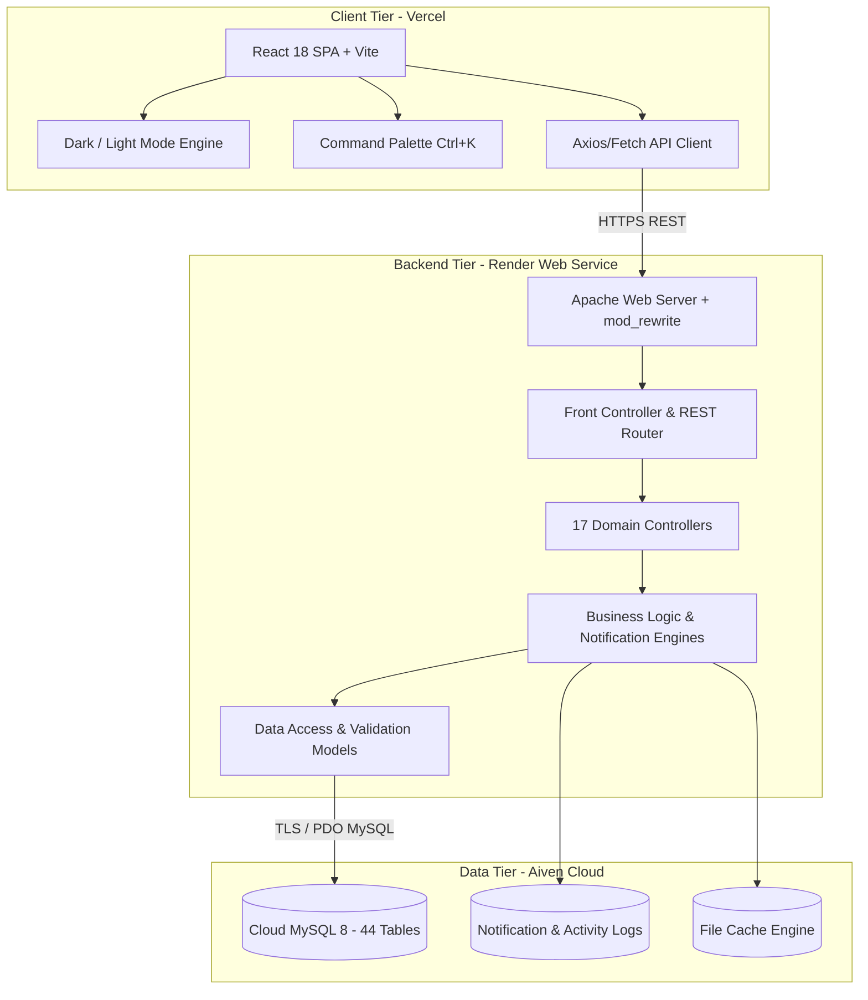

# HRMS - Modern Human Resource Management System

[](https://hrms-beta.vercel.app)
[](https://hrms-vf33.onrender.com)
[](https://aiven.io)
[](backend/tests/run_tests.php)
[](LICENSE)

An enterprise-grade, full-stack Human Resource Management System (HRMS) built with **React 18**, **Tailwind CSS**, a custom lightweight **PHP 8.2 REST API**, and **MySQL**. Featuring rich **Shadcn/UI-inspired aesthetics**, seamless dark/light modes, role-based workflows, automated notification dispatchers, shift rostering, performance appraisals, internal ticketing, and instant cloud deployment.

---

## 🌐 Live Production Demo

- **Frontend Application**: [https://hrms-beta.vercel.app](https://hrms-beta.vercel.app)
- **Backend API**: [https://hrms-vf33.onrender.com](https://hrms-vf33.onrender.com)
- **API Health Check**: [https://hrms-vf33.onrender.com/](https://hrms-vf33.onrender.com/)

---

## 🏛️ System Architecture



---

## 📦 Core Modules & Feature Breakdown

### 1. 📊 Executive Dashboard & Analytics
- **Live Metrics**: Total workforce count, daily presence percentage, pending approvals, and active helpdesk tickets.
- **Department Distribution**: Visual breakdown of staff across Engineering, HR, Product, Sales, and Operations.
- **Quick Action Bar**: 1-click shortcuts for punch-in, leave application, ticket creation, and salary slip access.
- **Real-Time Audit Feed**: Live chronological activity log of system events.

### 2. 👥 Employee Directory & 360° Profiles
- Complete employee CRUD with search, department filtering, and role categorization.
- Comprehensive member profiles detailing contact info, emergency contacts, compensation tier, assigned assets, and reporting manager.
- Status management (`Active`, `On Probation`, `On Leave`, `Terminated`).

### 3. ⏰ Attendance & Clock-In Engine
- Daily clock-in and punch-out with geolocation coordinates and IP capture.
- Automated status resolution: `Present`, `Late`, `Half Day`, `Absent`.
- Today's attendance ledger and monthly consolidated timecards.
- Real-time work hours computation with overtime detection.

### 4. 📅 Shift Scheduling & Team Roster Management
- **Shift Master**: Configure Morning, Evening, Night, and Rotational shifts with custom start/end times and grace periods.
- **30-Day Visual Roster Grid**: Calendar grid with department-wide shift allocations.
- **Peer-to-Peer Shift Swapping**: Employees request shift exchanges with colleagues; automatically routes to managers for sign-off upon acceptance.
- **Night Allowances & Overtime**: Auto-computes night differential allowances and overtime hours into payroll.

### 5. 🌴 Leave & Time-Off Management
- Multi-tier leave categories: Paid Casual Leave, Sick Leave, Earned Leave, Maternity, and Paternity.
- Real-time leave balance deduction and accrual rules.
- Employee leave application modal with date ranges, reason, and urgent contact info.
- Multi-level manager approval and rejection workflows.

### 6. 💰 Payroll & Compensation Master
- Granular salary structures: Base Salary, HRA, Conveyance, Special Allowances, PF deduction, Professional Tax, and TDS.
- Monthly payroll execution engine with payment reference tagging.
- Payslip generator with instant PDF download and print-ready layout.
- Historical payroll run summaries and compensation audit trails.

### 7. 🎯 Performance Management System (PMS)
- **OKR Tracking**: Strategic Objective creation with quantifiable Key Results and automated progress weight averaging.
- **Performance Review Cycles**: Dual-stage workflow supporting employee self-evaluations and manager appraisals.
- **9-Box Talent Matrix**: Dynamic 2D matrix mapping Performance vs. Potential (Star, Core Contributor, High Potential, etc.).
- **Direct Payroll Increments**: Finalized manager appraisals automatically calculate and apply recommended percentage increments directly to the employee's salary structure.

### 8. 🎫 Internal HR Helpdesk & Employee Ticketing
- **Ticket Categories**: `PAYROLL`, `IT-SUPPORT`, `HR-POLICY`, `GRIEVANCE` (Strictly Confidential), and `FACILITIES`.
- **Automated SLA Timers**: Category-specific deadlines dynamically calculated by priority (`Urgent`, `High`, `Medium`, `Low`).
- **Conversational Threading**: Real-time replies supporting employee public responses and private internal HR notes.
- **CSAT Ratings**: 5-star customer satisfaction rating with feedback upon ticket resolution.

### 9. 💬 Automated WhatsApp & SMS Notification Engine
- **Event-Driven Triggers**:
  - 🌴 **Leave Approvals**: Instant WhatsApp notification upon approval/rejection.
  - 💰 **Salary Disbursal**: WhatsApp message containing monthly salary slip link.
  - 🚀 **Onboarding Roadmap**: Day-1 onboarding checklist dispatched to new hires.
  - ⏰ **Attendance Alerts**: Late punch-in alerts or missing checkout warnings.
- **Delivery Webhook**: Ingestion of delivery receipts (`sent` $\rightarrow$ `delivered` $\rightarrow$ `read`).
- Gateway integration ready for WhatsApp Cloud API and SMS aggregators.

### 10. 💻 Asset & Hardware Inventory
- Inventory tracking for laptops, monitors, accessories, and licenses with serial numbers.
- Asset lifecycle states: `In Stock`, `Assigned`, `Under Maintenance`, `Retired`.
- Formal asset assignment and return records tied to employee profiles.

### 11. 🤝 Recruitment & ATS Pipeline
- Job opening creation with department, job type (Full-time, Remote, Contract), and headcount targets.
- Kanban recruitment stages: `Applied` $\rightarrow$ `Screening` $\rightarrow$ `Interview` $\rightarrow$ `Offered` $\rightarrow$ `Hired` $\rightarrow$ `Rejected`.
- Candidate rating system, interview notes, and CV tracking.

### 12. 🚀 Employee Lifecycle & Transitions
- Structured onboarding checklists with assigned tasks, deadlines, and mentors.
- Probation review checkpoints and promotion tracking.
- Offboarding exit workflow with asset recovery, IT clearance, and final payroll settlements.

### 13. 👤 Employee Self-Service (ESS) Portal
- Dedicated employee view for clocking in/out, viewing shift rosters, applying for time-off, raising helpdesk tickets, swapping shifts, and downloading salary slips.

### 14. ⚖️ Manager Approvals Center
- Consolidated manager inbox aggregating pending leaves, shift swaps, expense claims, and performance reviews with 1-click batch actions.

### 15. ⌨️ Global Command Palette (`Ctrl + K` / `Cmd + K`)
- Instant keyboard navigation to jump between any module, action, or setting in milliseconds.

---

## 🛠️ Technology Stack

| Layer | Technologies |
| :--- | :--- |
| **Frontend UI** | React 18, Vite 4, Tailwind CSS, Lucide React Icons |
| **Styling & Theme** | Shadcn/UI dark aesthetic, Custom CSS tokens, Inter & JetBrains Mono typography |
| **Backend API** | PHP 8.2+, Custom MVC Micro-Framework, Apache mod_rewrite, RESTful JSON |
| **Database** | MySQL 8.0 / MariaDB (InnoDB, Foreign Key Constraints, Indexes) |
| **Testing** | PHP CLI Custom Test Runner (408 unit & integration tests) |
| **Containerization** | Docker (`php:8.2-apache` base image) |
| **Cloud Hosting** | Vercel (Frontend), Render (Backend Web Service), Aiven (Managed MySQL) |

---

## 📂 Project Directory Structure

```
hrms/
├── backend/                        # PHP Backend REST API
│   ├── api/                        # API Entrypoint & Front Controller
│   │   ├── index.php               # Main route dispatcher & CORS configuration
│   │   └── .htaccess               # Apache URL rewrite rules for /api/*
│   ├── config/                     # Core Configuration
│   │   ├── Database.php            # Singleton PDO connection with SSL & Env support
│   │   └── Cache.php               # File-based caching layer
│   ├── controllers/                # REST Controllers (17 controllers)
│   │   ├── AttendanceController.php
│   │   ├── HelpdeskController.php
│   │   ├── LeaveController.php
│   │   ├── NotificationController.php
│   │   ├── PmsController.php
│   │   ├── SalaryController.php
│   │   ├── ShiftController.php
│   │   └── UserController.php ...
│   ├── core/                       # Core Framework
│   │   ├── Controller.php          # Base controller
│   │   ├── Request.php             # HTTP request wrapper & URI parser
│   │   ├── Response.php            # JSON response standardizer
│   │   └── Router.php              # Regular expression URI router
│   ├── models/                     # Data Access & SQL Queries (17 models)
│   ├── services/                   # Business Logic, Calculators & Dispatchers
│   └── tests/                      # Automated Test Suite
│       ├── run_tests.php           # Master test runner (408 tests)
│       ├── HelpdeskTest.php
│       ├── NotificationTest.php
│       ├── PmsTest.php
│       └── ShiftTest.php ...
├── src/                            # React 18 Frontend
│   ├── components/                 # Component Library
│   │   ├── common/                 # CommandPalette, Modals, Badges
│   │   ├── hrms/                   # Module Pages (Attendance, Helpdesk, PMS, Roster...)
│   │   └── layout/                 # Sidebar, Header, ThemeToggle
│   ├── services/                   # Frontend API Client
│   │   └── api.js                  # Centralized fetch wrapper with dynamic VITE_API_URL
│   ├── App.jsx                     # Root application & routing
│   ├── index.css                   # Tailwind tokens & dark theme styles
│   └── main.jsx                    # React DOM entry
├── scratch/                        # Cloud Utilities & Helpers
│   └── cloud_import.php            # 1-click cloud database schema & seed importer
├── database.sql                    # Clean UTF-8 dump with all 44 tables & seed records
├── Dockerfile                      # Cloud container deployment configuration
├── render.yaml                     # Render Infrastructure as Code blueprint
├── vercel.json                     # Vercel SPA client-side routing rewrites
└── package.json                    # Node.js dependencies & scripts
```

---

## ⚡ Local Development Setup

### Prerequisites
- **PHP 8.2 or higher** with `pdo` and `pdo_mysql` extensions enabled (e.g., via XAMPP)
- **MySQL / MariaDB** (running locally on port 3306)
- **Node.js 20.x or higher** and `npm`
- **Git**

---

### Step 1: Clone the Repository
```bash
git clone https://github.com/vishwaaniruddh/hrms.git
cd hrms
```

### Step 2: Database Initialization (Local XAMPP)
1. Open XAMPP Control Panel and start **Apache** and **MySQL**.
2. Open your MySQL client or terminal and create the local database:
```sql
CREATE DATABASE hrms_db CHARACTER SET utf8mb4 COLLATE utf8mb4_unicode_ci;
```
3. Import the complete database schema and seed records:
```bash
# Windows PowerShell
Get-Content database.sql | c:\xampp\mysql\bin\mysql.exe -u root hrms_db

# Linux / macOS
mysql -u root hrms_db < database.sql
```

### Step 3: Backend Configuration
By default, [`backend/config/Database.php`](backend/config/Database.php) will seamlessly connect to local XAMPP (`localhost`, port `3306`, user `root`, blank password, database `hrms_db`).

To run the automated PHP test suite and verify everything is working:
```bash
# Run all 408 tests
php backend/tests/run_tests.php
```
Expected output:
```
══════════════════════════════════════════
Results: 408/408 passed
🎉 All tests passed!
══════════════════════════════════════════
```

### Step 4: Frontend Setup
1. Install dependencies:
```bash
npm install
```
2. Start the Vite development server:
```bash
npm run dev
```
3. Open your browser and navigate to:
```
http://localhost:5173
```

---

## 🚢 Cloud Deployment (100% Free Hosting)

The repository is pre-configured for zero-friction cloud deployment:

### 1. Database (Aiven MySQL)
- Sign up at [Aiven.io](https://aiven.io/) and create a **Free MySQL** instance.
- Run the built-in import script:
```bash
php scratch/cloud_import.php <host> <port> defaultdb avnadmin <password>
```

### 2. Backend (Render Web Service)
- Connect repository `vishwaaniruddh/hrms` on [Render](https://render.com/).
- Runtime: **Docker** (Render reads root [`Dockerfile`](Dockerfile)).
- Plan: **Free**.
- Set Environment Variables:
  - `DB_HOST` = `<your-aiven-host>`
  - `DB_PORT` = `<your-aiven-port>`
  - `DB_NAME` = `defaultdb`
  - `DB_USER` = `avnadmin`
  - `DB_PASS` = `<your-aiven-password>`

### 3. Frontend (Vercel)
- Import your repository on [Vercel](https://vercel.com/).
- Framework Preset: **Vite**.
- Root directory: `./`.
- Environment Variable:
  - `VITE_API_URL` = `https://<your-render-backend-url>`
- Click **Deploy**.

---

## 🔑 Default Login Credentials

| Role | Email | Password | Access Level |
| :--- | :--- | :--- | :--- |
| **Super Admin** | `info@softnio.com` | `admin123` | Full access across all 15 modules & settings |
| **Manager** | `emma.walker@example.com` | `admin123` | Department management, roster shifts, approvals |
| **Employee** | `julian.morales@example.com` | `admin123` | Employee Self-Service (ESS), clock-in, helpdesk |

---

## 🧪 Testing & Quality Assurance

The codebase includes an extensive automated test suite covering:
- **Core CRUD Operations**: Users, departments, assets, leaves, attendances.
- **Payroll Computation Engine**: Gross salary, taxes, allowances, and deductions.
- **Shift Swapping State Machine**: Peer validation, manager approval guards, roster exchanges.
- **Helpdesk SLA Engine**: Automated deadline computation, confidential ticket visibility restrictions.
- **WhatsApp Webhook Ingestion**: Delivery receipt state transitions (`sent` $\rightarrow$ `delivered` $\rightarrow$ `read`).

To run the test suite:
```bash
php backend/tests/run_tests.php
```

---

## 📄 License

This project is licensed under the **MIT License**. Feel free to use, modify, and distribute for personal and commercial projects.
